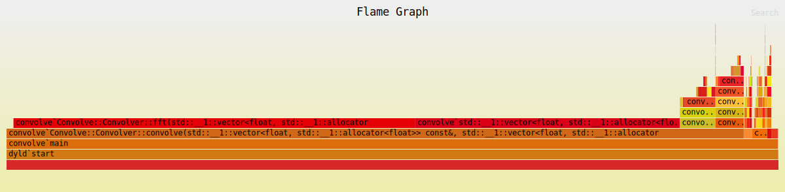
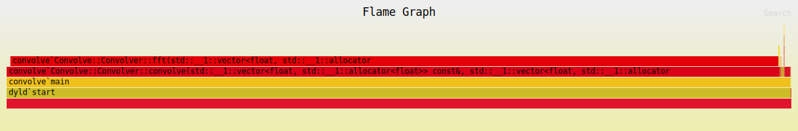
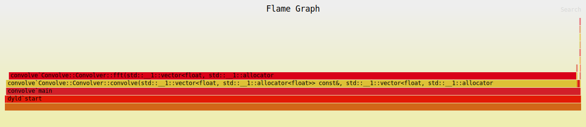
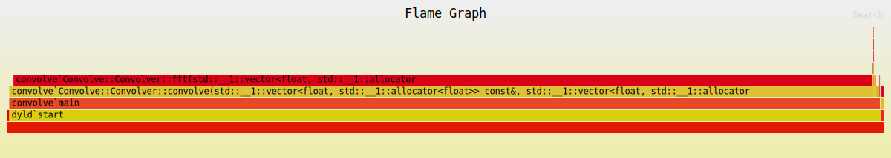

# convolve

## CPSC 501 A4 Report

The convolve project encompasses multiple versions of a convolution algorithm, each tagged in the Git repository. The initial version (v1.0) implements a straightforward time-domain convolution algorithm. Subsequent versions include algorithm-based optimizations (v2.0), compiler-level optimizations (v3.0), and versions optimized using code tuning, denoted as v4.0, v4.1, v4.2, v4.3, and v4.4. The optimizations lead to significant improvements in execution time, as evidenced by timing results, where v2.0 outperforms v1.0 and v3.0 introduces compiler-level optimizations. Profiling information, including flamegraphs, offers insights into the performance characteristics of each version. Regression testing, executed through audiodiff.py, ensures consistency in the output across versions, affirming that the convolution results remain unchanged. The project emphasizes systematic improvement, with all versions and profiling results meticulously documented and accessible in the Git repository.

## v1.0 - Baseline Program

The baseline program implements a convolution algorithm directly in the time domain. 

```C++
std::vector<float> Convolver::convolve(const std::vector<float> &x,
                                       const std::vector<float> &h) {
  std::vector<float> y(x.size() + h.size() - 1, 0.0);
  std::cout << "Convolving input signal and impulse response" << std::endl;

  int n, m;

  for (n = 0; n < y.size(); n++) {
    y[n] = 0.0;
  }

  for (n = 0; n < x.size(); n++) {
    for (m = 0; m < h.size(); m++) {
      y[n + m] += x[n] * h[m];
    }
  }

  return y;
}
```

## v2.0 - Algorithm-Based Optimization

The algorithm-based optimized program re-implements the convolution algorithm using a frequency-domain FFT convolution algorithm.

```C++
std::vector<float> Convolver::convolve(const std::vector<float> &x,
                                       const std::vector<float> &h) {
  std::cout << "Convolving input signal and impulse response" << std::endl;

  size_t outputSize = x.size() + h.size() - 1;
  size_t nn = pow(2, ceil(log2(x.size() * 2)));
  size_t k, real, imag;

  std::vector<float> X(nn * 2 + 1, 0.0f);
  std::vector<float> H(nn * 2 + 1, 0.0f);
  std::vector<float> Y(nn * 2 + 1, 0.0f);

  for (k = 0; k < x.size(); k++) {
    real = (k * 2) + 1;
    imag = real + 1;
    X[real] = x[k];
    X[imag] = 0.0f;
  }

  for (k = 0; k < h.size(); k++) {
    real = (k * 2) + 1;
    imag = real + 1;
    H[real] = h[k];
    H[imag] = 0.0f;
  }

  fft(X, nn, 1);
  fft(H, nn, 1);

  for (k = 0; k < nn; k++) {
    real = (k * 2) + 1;
    imag = real + 1;
    float Xr = X[real], Xi = X[imag];
    float Hr = H[real], Hi = H[imag];
    Y[real] = (Xr * Hr) - (Xi * Hi);
    Y[imag] = (Xr * Hi) + (Xi * Hr);
  }

  fft(Y, nn, -1);

  for (k = 0; k <= nn; k++) {
    real = (k * 2) + 1;
    Y[real] /= static_cast<float>(nn);
  }

  std::vector<float> result(outputSize);
  for (size_t k = 0; k < outputSize; k++) {
    real = (k * 2) + 1;
    result[k] = Y[real];
  }

  return result;
}
```

## v3.0 - Compiler-Level Optimization

The compiler-level optimization version compiles source code with the gcc/g++ -O3 flag set.

## v4.0 - Code Tuning Optimization - Vector Initialization 

Reserving space for vectors using reserve() improves runtime and is more efficient. The below code snippets show vector initialization prior to and after this optimization.

vector initialization prior to optimization:
```C++
std::vector<float> X(nn * 2 + 1, 0.0f);
std::vector<float> H(nn * 2 + 1, 0.0f);
std::vector<float> Y(nn * 2 + 1, 0.0f);
```

vector initialization after optimization:
```C++
std::vector<float> X(0.0f);
X.reserve(nn * 2 + 1);
std::vector<float> H(0.0f);
H.reserve(nn * 2 + 1);
std::vector<float> Y(0.0f);
Y.reserve(nn * 2 + 1);
```

## v4.1 - Code Tuning Optimization - Multithreading Vector Initialization

Vector initialization was optimized by using multithreading to parallelize initialization of X and H.

```C++
const size_t numThreads = std::thread::hardware_concurrency();
size_t chunkSizeX = x.size() / numThreads;
size_t chunkSizeH = h.size() / numThreads;

std::vector<std::thread> threadsX(numThreads);
for (size_t i = 0; i < numThreads; i++) {
threadsX[i] = std::thread(parallelLoop, std::ref(X), std::cref(x),
                            i * chunkSizeX, (i + 1) * chunkSizeX);
}

for (auto &thread : threadsX) {
thread.join();
}

std::vector<std::thread> threadsH(numThreads);
for (size_t i = 0; i < numThreads; i++) {
threadsH[i] = std::thread(parallelLoop, std::ref(H), std::cref(h),
                            i * chunkSizeH, (i + 1) * chunkSizeH);
}

for (auto &thread : threadsH) {
thread.join();
}
```

## Timing

All programs were timed using `time ./build/src/convolve ./build/src/guitar.wav ./build/src/big_hall_mono.wav ./tests/output<version>.wav`.

| Version | Time                                             |
| ------- | ------------------------------------------------ |
| v1.0    | 830.50s user 0.22s system 99% cpu 13:53.90 total |
| v2.0    | 3.56s user 0.02s system 99% cpu 3.592 total      |
| v3.0    | 1.43s user 0.03s system 83% cpu 1.735 total      |
| v4.0    | 1.42s user 0.02s system 99% cpu 1.452 total      |
| v4.1    | 1.43s user 0.03s system 100% cpu 1.448 total     |

### Profiling

All programs were profiled by creating and examining flamegraphs by running `flamegraph --output flamegraph<version>.svg --root -- ./build/src/convolve ./build/src/guitar.wav ./build/src/big_hall_mono.wav ./tests/output<version>.wav`

#### v2.0



### v3.0



### v4.0



### v4.1



### v4.2

### v4.3

### v4.4

## Regression Testing

Regression testing is accomplished by comparing the output.wav files between versions, ensuring convolve() produces the same result. Running `python3 ./tests/audiodiff.py` compares the output wav files by comparing the frames produced by all versions of convolve(). Below is the output produced by `audiodiff.py`.

```zsh
❯ /opt/homebrew/bin/python3 /Users/kadinsayani/dev/convolve/tests/audiodiff.py


./tests/outputv1.0.wav
Number of channels 1
Sample width 2
Frame rate 44100
Number of frames 817508530


./tests/outputv2.0.wav
Number of channels 1
Sample width 2
Frame rate 44100
Number of frames 817508530


./tests/outputv3.0.wav
Number of channels 1
Sample width 2
Frame rate 44100
Number of frames 817508530


./tests/outputv4.0.wav
Number of channels 1
Sample width 2
Frame rate 44100
Number of frames 817508530


./tests/outputv4.1.wav
Number of channels 1
Sample width 2
Frame rate 44100
Number of frames 817508530
Output wav files are equal
--------------------------
All tests passed ✅
```
